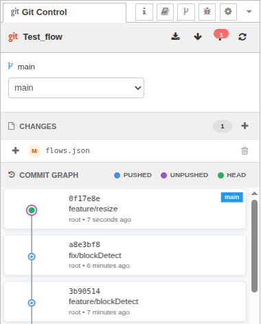

# node-red-contrib-git-control

A Node-RED sidebar plugin for Git version control. Manage commits, branches, merges, and remote synchronization directly from the editor — including flow-aware diff, revert, and merge-conflict resolution that understands `flows.json` at the node level.



## Why you might want it

- **Flow-aware merge resolver**: When a merge conflicts on `flows.json`, the plugin decomposes it into per-tab / per-node 3-way diffs. Take ours, take theirs, or hand-pick per node — no manual JSON surgery.
- **Flow-aware diff & revert**: Diff a single tab or subflow against any commit, and revert one tab (or a specific node) without touching the rest of the flow file.
- **Visual commit graph**: Branch labels, push status, and parent relationships on a canvas-based timeline.
- **Detached HEAD safety**: Auto-branches when committing from historical states to prevent orphaned commits.
- **Flow synchronization**: Reloads flows after checkout, reset, pull, or merge so the editor stays in sync with disk.
- **Conflict / interrupted-op safety net**: A persistent banner appears whenever the repo is mid-merge, mid-cherry-pick, mid-revert, or mid-rebase, with one-click Resolve and Abort actions.
- **Smart error messages**: Context-aware suggestions guide you through divergence, lock issues, missing upstreams, etc.
- **Integrated workflow**: Uses Node-RED's project system and SSH keys — no separate Git configuration needed.

## Quick start

1. Install the plugin in your Node-RED user directory:
   ```bash
   cd ~/.node-red
   npm install @rosepetal/node-red-contrib-git-control
   ```

2. Restart Node-RED.

3. Open the Node-RED editor and look for the **Git Control** tab in the right sidebar (next to Debug, Config, etc.)

Node-RED 2.0+ with projects enabled is required. The plugin works only with Node-RED project directories that are Git repositories.

## Using the sidebar

### Toolbar
- **Fetch**: Download updates from remote without merging
- **Pull**: Download from remote and merge (reloads flows automatically)
- **Push**: Upload commits to remote (auto-sets upstream for new branches; offers a 3-way decision — Cancel / Pull / Force push — when the remote has diverged)
- **Refresh**: Reload all data from repository

Sync indicators show how many commits you are ahead/behind the remote.

### Branch picker
Pick a branch from the combo, or open the branch action menu (the icon next to the combo) for:
- **Create branch** (from current or any commit)
- **Create orphan branch**
- **Merge branch into current** (flow-aware resolver kicks in if `flows.json` conflicts)
- **Rename branch**
- **Delete branch**

Remote-only branches (not yet checked out locally) appear alongside local branches.

### Changes panel
- **Unstaged**: modified, created, or deleted files not yet staged
- **Staged**: files ready to commit

Use **+** to stage individual files or stage all at once, **−** to unstage. The trash icon on unstaged files discards changes (⚠️ irreversible).

### Commit panel
With staged changes: enter a message and click **Commit**. If you're in detached HEAD (viewing an old commit), the plugin creates a new branch automatically (named `from-<hash>`) to preserve your work.

### Commit graph
Visual timeline:
- **Blue nodes**: commits already pushed to remote
- **Purple nodes**: local commits not yet pushed
- **Green center**: current HEAD
- **Branch labels**: which branches point to each commit

Click any commit to open an actions modal: switch to commit, diff against working tree, see which branches contain it. Hover for hash + message.

### Flow-aware diff & revert
From any commit's modal, open the diff against the current working tree. The diff is grouped by tab / subflow — each conflicting node is shown in isolation with its base, ours, and theirs versions. From there you can:
- **Revert a whole tab** to the chosen commit's version
- **Revert a single node** without disturbing the rest of `flows.json`

### Merge conflict resolver
When a pull or merge produces a conflict in `flows.json`, the conflict-safety banner exposes a **Resolve** button that opens a full-screen 3-way diff modal:

- **Bulk choice**: "Take ours for all" / "Take theirs for all" (global, wins over per-tab and per-node choices)
- **Per-tab choice**: "Take ours" / "Take theirs" for an entire tab/subflow
- **Per-node choice**: pick base/ours/theirs for individual nodes, with field-level diffs for long values
- **Commit message**: pre-filled from `.git/MERGE_MSG`, editable

The resolver is also fully driveable from outside the UI — see [`docs/http-api.md`](docs/http-api.md) for the `merge/preview` and `merge/resolve` endpoints.

### Detached HEAD warning
If you check out an old commit, a warning banner appears explaining you're in detached HEAD state. Click **Return to Latest** to go back to your branch tip.

## HTTP API

The plugin exposes admin HTTP endpoints for scripting, testing, and external tools (including AI agents). Full reference with request/response examples lives in [`docs/http-api.md`](docs/http-api.md).

Highlights:

| Category | Endpoints |
|---|---|
| **Project / status** | `project-info`, `status`, `log`, `branches`, `commit-branches` |
| **Working tree** | `add`, `unstage`, `commit`, `discard`, `discard-all`, `reset` |
| **Branches** | `checkout`, `validate-checkout`, `create-branch`, `orphan-branch`, `delete-branch`, `rename-branch`, `set-upstream` |
| **Remote** | `fetch`, `pull`, `push`, `force-push` |
| **History ops** | `merge`, `revert`, `cherry-pick`, `abort` |
| **Conflict resolver** | `merge/preview`, `merge/resolve` |
| **Diff** | `file-diff`, `commit-diff`, `flow-diff`, `flow-units` |
| **Flow-aware revert** | `revert-flow-unit`, `revert-flow-nodes` |
| **SSH keys** | `ssh-keys`, `ssh-key` |

All routes require `git-control.read` or `git-control.write` permissions when Node-RED admin authentication is enabled. Read endpoints work with a bearer token; mutating endpoints same.
